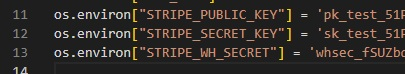
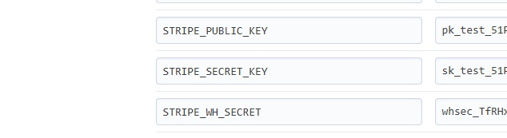

# Mellifera
A simple B2C ecommerce website for the online sale of honey-bee-related equipment, materials, tools, consumables and packaging to German hobby beekeepers.

Code Institute - Fifth Milestone Project: Under my interpretation, the requirements for this project would be satisfied as follows:

Build a Full-Stack e-commerce website that facilitates the online sale of and payment for a range of beekeeping-related goods based on a business logic that reflects the variety and taxonomy of that range of goods, satisfying the expectations of both an imaginary online store owner and of their very real potential customers.

I believe that completing such a project would satisfy the requirements listed for the fifth porfolio project in Code Institute's LMS, i.e. to show  an appropriate level of understanding on my part of a number of different concepts, technologies and disciplines related to Full-Stack programming in the e-commerce sector:

- Django development on a cloud-based IDE (using Django-3.x on a VS Studio IDE hosted on Gitpod).
- The creation, maintenance and use in Python code of database models, implemented using Django, running on Postgresql.
- Use of agile methodologies via the project features available in GitHub, associated with the repository for this portfolio project.
- Creation of UI elements outside Django's admin panel to allow users to create and update records in database tables.
- The use of robots.txt and sitemap.xml files.
- The use and purpose of descriptive metatags in HTML code.
- How to link to external resources using the Rel attribute.
- How to make a custom 404 error page.
- The use of social media, using the instance of a (dummy) Facebook presence as an example.
- Creation of a newsletter signup form.
- The use of DEBUG mode, and in particular the need to switch it to False before deploying.
- The Django functionality allowing users to log in and out of the project application.
- The use of Stripe together with Django, bootstrap and bespoke HTML, CSS, JavaScript and Python code to demonstrate a(n almost) working online purchasing system
- The correct use of linting to check code formatting.
- Detailed human-made logs of testing processes.
- Appropriate use of online research and problem-solving resources publicly available on the Internet.


*Traditional beehives (using the Langstroth 10-frame system) on an autumn evening*

## A note to the assessors
I do not expect this portfolio project to achieve the pass criteria in its current state. A number of the requirements listed in the instructions for it have not yet been implemented. I am obviously not a very fast coder yet, for which I apologise. In my defence, I should say that I feel that, out of the three options for the final module of the course, at least the e-commerce option &mdash;and in particular the walkthrough for the boutique-ado ecommerce website&mdash; involves a good deal more work (rather than simply more complexity) than the first four modules and, though I was to some extent forewarned of this, I didn't expect the difference in terms of time required to be _quite_ as big as it has turned out to be. There were a number of other circumstances, including a short bout of illness, that contributed to my inability to finish on time, but those circumstances paled into insignificance beside the widely recognised technical flaws and continuity gaps in the final walkthrough, as well as its sheer length.

I am determined however, to get this final part of the course done properly, given a reasonable amount of time to complete the job. I realise that my failure to complete the 5th project on time will put a pass ceiling on my efforts, but my priority has always been to learn the skills I need to learn rather than to receive an especially impressive grade on my certificate.

This Readme file (especially from line 214 on) should be treated as a set of notes for the later finalisation of my eventual Readme file for the finished portfolio project.

I'm very grateful to the tutors for their ongoing help in getting through this very challenging section of the course (though they were also just as supportive, encouraging, patient and competent in earlier parts of the course) and to my customer care person for their encouragement and advice. I'm grateful too to my mentor for the help he has provided so far, and I hope to benefit further from his expertise and generosity over the next couple of weeks in my efforts to finish this project.

Thanks very much to you as well for your patience!  And my sincere apologies for the unfinished state of my project!

[TOC]

## How the idea came about

### The initial proposition

The very fictional Elise Knolle is a Berlin-based amateur beekeeper who, while on an equally fictional skiiing holiday in mountainous Northern Bohemia a few months ago, met an imaginary woodworker who makes high-quality beehive boxes and honey frames in the spruce and pine lumber local to the area. He makes a good living selling his wooden products at competitive retail prices. He also makes higher quality cedar boxes at a higher, though still relatively attractive retail prices. Elise (who had, with some relief, just completed an online course in Full-Stack Development at the famous Irish training body, Code Institute) hit it off immediately with the Czech woodworker on meeting him one evening during the apres-ski. After a generous helping of excellent food, washed down with an excellent Pilsner beer and a glass of homemade herbal schnapps, the conversation &ndash;as occasionally happens in such circumstances&ndash; turned to business.

Tomáš (for that's his name) has a good deal of experience sending his wares by DHL around the Czech Republic, Poland and Slovakia, and is the proud owner of some very expensive and sorely under-exploited woodworking tools and machinery. As such, he's keen to expand his production, with the first option for achoeving this being extending his products' geographical market. Early in his conversation with Elise (neither spoke the other's native language, so they communicated in English), he learnt two facts that made his ears prick up: firstly, that there are no less than 150,000 hobby beekeepers in Germany, and secondly, that Elise is currently having to buy beehive boxes of what she considers inferior quality from a Brandenburg-based specialist at a significantly higher price (after conversion into Euros).

As the conversation went on, Elise, who is not rolling in money (ski holidays are rather cheaper in Czechia than in, say, Austria), and is tempermentally unsuited to working as anyone's employee, began outlining  to Tomáš (with increasing excitement) the training she had so recently received from the Dublin-based IT training institute, but then suddenly broke off her monologue, took a deep breath and, with a nervous smile, put a hypothetical question to Tomáš: if she were ever in a position to pass on orders for his wares to him from the DACH area (Germany, Austria and Switzerland), would he be prepared to pay her a commission and give her a guarantee of no diminution in quality in the goods sent via orders she had generated. He, cottoning on to what it was she was (still hypothetically) hinting at, replied that he'd be very happy with such an arrangement. Given the lateness of the evening, though, (said he) perhaps they ought to meet in the morning to talk about the matter further.

The following day they met in a café near the bottom of the ski slope (Elise was happy to give up her skiing for the day to continue her conversation with Tomáš), they came to the following arrangement:

Within three monts of arriving back in Berlin, Elise should put together a proof-of-concept version of a B2C e-commerce website designed to sell Tomáš' wares to German beekeepers and would return to Czechia to show Tomáš the results of her efforts and to discuss how much work still needed to be done to get the website up and running. They could then discuss what, if anything, Tomáš would be willing to contribute to the completion and final deployment of the website, including its localisation into German, its internationalisation for the Swiss and Austrian markets (at least) and the simple web-marketing, security and analytical functionality that the system would be likely to require.

The project I'm now presenting should be looked upon as if it were the test website that Elise built and turned up a few months later to present to Tomáš. It doesn't include the aforementioned localisation or internationalisation, nor the sort of security and analytical functionality that a real-world working website would need.

### Elise's thought processes after her chats with Tomáš.
Even as her train trundled back across the Czech border on its way back home to Berlin, Elise had already begun mulling over the complications that might face her in her coding efforts.

For one thing, different beekeepers all over the world use a variety different standard sizes in their hive components and they'd have to be very convinced they were buying the right sizes for their particular configuration before they'd be remotely likely to buy from an unfamiliar website. For another, the standard measurements for hive boxes that developed over the history of beekeeping generally relate to the interior dimensions of such boxes, which are governed by whatever standard-sized bee frames beekeepers have chosen for their system.

While Tomáš had reassured her that he can make hive boxes according to whatever measurements she might want, Elise realised she wasn't very clear herself on the variety of exterior measurements of boxes used by German beekeepers. While the critical measurements for hive boxes are their interior measurements, getting the exterior sizes right may well help beekeepers combine their newly purchased boxes tidily with the ones they already have. Though boxes with thinner or thicker walls can usually be placed on top of one another, any lips or ledges left may look a little unruly, and might even shorten the useful life of the bee boxes, as such lips can allow water to lie in nooks and crannies &mdash; and standing water will significantly accelerate rotting processes in wood, especially since the wood used in beekeeping, for obvious reasons, can't be treated with anti-rot chemicals of any sort.

Thankfully, the standard frames that are hung inside such boxes are slightly less complicated, generally varying only in terms of length and depth to match only the interior measurements of that box. The actual thickness of the timber used to make such frames is most often a fairly standard 9.5 mm (or about 3/8 of an inch for the more old-fashioned among us).

Despite this little mercy, all these factors seemed like worrying complications. It was nothing she couldn't handle (thought she) by adjusting her data models and workflow to take account of it, relying on Tomáš' reassurances.

- - -

## Initial design
So, almost as soon as she got back to Berlin, Elise got to work, starting by sketching out a wireframe using the Balsamiq app in test version on the cloud.

As you can see from the pictures she sketched out, she concieved it as a pretty standard B2C e-commerce website in which the user is greeted on a homepage and pretty much immediately invited to scroll through the list of products available in the shop, albeit with a fairly specialised multi-layer filtering system to help the user hone in on the precise products with the precise interior measurements and wall thicknesses they need.

The usual options allowing the user to register, log in and log out are also available. 

While Elise is conscious of the benefits of using a mobile-first design philosophy, she decided to base her wireframe on small laptop or tablet screen (with a resolution of 1024 x 786 pixels), knowing as she does from experience that most beekeepers would use their household laptop or tablet to make their online beekeeping purchases. However, she also made a couple of sketches for a standard mobile app.


*Elise's initial wireframe for her project homepage*

It had struck Elise since taking up beekeeping how her fellow beekeepers introduced themselves in beekeeping circles by mentioning the beekeeping system they used straight after giving their name.  Elise has in fact developed the habit herself: she now almost automatically starts every talk she gives to beekeepers with the words (translated from the German) "My name's Elise Knolle and I work using Langstroth". Other users of the Langstroth measurements then know immediately that their systems work well with hers, making it easier for them to help each other with spare beehive resources when someone is short of some resource or other, or wants to expand. Indeed the expression "working out of System X" is almost a declaration of identity in beekeeping circles, and thus it quickly occurred to her that the names of such systems (Langstroth, Dadant, Zander and DNM -- _Deutsche Normalmaß-Beute_) were likely very useful keywords for marketing purposes. She therefore noted these and a number of related terms as such in her notebook for short-tail keywords (see the sub-section on web marketing below).

The wireframe she made is primarily for her own reference, but also to show her friends in the local beekeeping society so they can give a little marketing-relevant feedback. I'll now discuss the feedback they and others gave her in the Marketing section below.

- - -

## Product range & Marketing

### Face-to-face 'interviews'

Elise didn't actually do any formal face-to-face interviews with anyone (hence the scare quotes above), what she did was corner a number of fellow beekeepers, show them her wireframes and explain her plan in more or less detail, treating them as a sort of informal focus group. I won't reproduce the copious notes she took of these conversations; suffice it to say that the most important points they made included the following:

- Product range
>> Their expectations of such an e-commerce website were rather more ambitious than Elise's original idea: they would have expected a wider range of products to be available aside from wooden hive components. They saw it as desirable that the site should as near as possible be a "one-stop-shop" for beekeeper needs; to have in particular the capacity to offer the following categories of product:
  - plastic feeder trays, sleeves and bottles
  - pest treatment equipment and chemicals (especially against varroa mites)
  - beekeeper tools (all the way from handtools and buckets to honey extracting centrifuges and the like) 
  - protective and hygienic clothing
  - retail honey packaging (chiefly jars of various sizes and their lids)
  - wax 'foundations' for insertion into honey and brood frames
>> but ...
  - living bees
>> The one thing they seemed to agree was not necessary (or even desirable) for her to sell in her shop were packages of bees themselves: mated queen packages, living hive nuclei, etc.. The consensus was that such products should be left to a specialist producer/dealer and that offering them would do little to add to the site's reputation as a reliable and professional supplier

- Filtering by basic hive design
>> Beekeepers appreciated her idea of giving them up-front on the homepage the option of filtering out hive components incompatible with their hive dimensions by clicking on their chosen system as it appeared in a horizontal bar at the bottom of the site header, which would have the effect that all their subsequent searches limit themselves to products compatible with their systems, unless and until they decided to undo their filter by clicking on the name of their chosen system again. As long as the user does not select any particular beekeeping system, no such filter is enforced.

- Other filters and sorting options
They also let her know that the ability to filter according to a number of different criteria would be appreciated, with the general consensus being that "the more, the better", but that the site's products should be filterable and sortable according to the categories mentioned above under "Product range" (except anything involving live bees).

- Added marketing discussions
  - Beekeeper's forum
>> There was some humming and hawing when Elise mentioned the possibility of adding a separate beekeeping forum attached loosely to the site: there was no clear consensus, but many thought the internet already had plenty of discussion fora on the internet for beekeepers and that a new one, aside from requiring an awful lot of moderation effort, would not provide much added value at the moment for potential customers.
  - Techno-beekeeping blog
>> However, some of her pals seemed at least mildly interested when she mentioned the idea of adding a little blog to her site, especially if she concentrated on the interface between apiculture and consumer software development.
  - Hive inspection app 
>> The hive inspection app that Elise had half finished using the Flutter framework a couple of years ago, whose purpose it was to make it easier for beekeepers to note down observations while inspecting their hives, seemed to some to be a potentially useful tool, on condition she managed to complete and fully test it and make it available on Google Play and/or Apple App Store. Having such a tool associated with the site, many thought, could well add authority to it in its extremely clearly defined domain if it was well-designed and finished. There were other products already on the market, but they were all too inflexible in their workflow and were, in the words of one unhappy early adopter, "not much use".
  - Bee info page
>> A page listing links to official local and national beekeeping authorities, associations and university faculties were mentioned as being possible useful services to site users.

### Phone calls and e-mails with Tomáš
Through some more or less detailed conversations with Tomáš via WhatsApp and email, she got a clearer idea of the full range of products he can supply. As well as simple bee boxes and frames, he can also supply a couple of designs for entrance and feeder boxes, queen excluders, inner covers and bee escapes, for example, and he has a business partner whose phone number he can give who makes excellent galvanised steel hive roofs in various sizes.

### Other consultations
A number of chats with relatives and non-beekeeping friends underlined the point that Elise's site is far more likely to be successful if she manages to put herself in a position to sell a full range of beekeeping supplies.

One enormously important area of research will of course be to see what the compeition is doing. There are already a large number of beekeeping e-commerce sites already on the internet aimed at the DACH market. Practically everyone with whom she discusses her _Mellifera_ site mentions this as an essential part of her preparations. The obvious rubric in which to frame this information-gathering effort is to see it as a way to formally define the site's unique selling proposition (USP) on the basis of places Elise can go (with Tomáš' and perhaps others' help) that other online beekeeping suppliers can't or won't. The initial competitive advantage she has identified is value for money at the quality end of the market, but there may well be others. She suspects, for example, she can project superior authority and expertise in the beekeeping sector through better organisation and presentation of information on compatibility and incompatibilities between popular standard beehive designs used in the DACH region.

She believes that the improvement in the UX resulting from easier identification of compatible equipment is very likely to substantially improve sales.


## Elise's initial marketing conclusions

### Marketing-relevant measures for immediate action

- The first of Elise's conclusions from all this informal consultation was that she definitely needs to find suppliers for all the other commonly required beekeeping supplies. That task will have to take a high priority as soon she's successfully concluded her code demonstration for Tomáš. 

- She'll add a newsletter subscription facility early in the development process as it's likely to be relatively simple to code a GDPR-compliant subscription form and doing so won't commit her to extra work on a regular basis: she can always write up newsletters as the need and opportunity arises.

- While the site will need to be developed in English for Tomáš's sake, she'll have to keep in mind the need for it to switch the live version of the shop to German by default in a German-speaking DACH environment (it's a pretty basic marketing requirement to speak to one's customer base in their own native language), but to switch to English (and stay there) if the user expresses a preference for English. Though, depending on the time available to her, she may decide to leave internationalisation to a later stage and simply replace all the English texts with German once Tomáš had given the go-ahead.

- Elise will need to identify and formulate her USP, and set further marketing objectives to ensure that her chosen USP becomes and remains a reality.

- She'll need a set of logos, fonts, styles and colour schemes, which she'll develop on an ongoing basis while developing her proof-of-concept site.  She'll also consult with a designer friend of hers on how the site's look might be improved once she's completed the demo.

- Elise is a keen user of Facebook (perhaps too keen, she often thinks); she'll put together a Facebook page for _Mellifera_, render it as far as possible in the website's livery (see the previous point) and try to contribute to it occasionally, other work permitting.

- Elise reckons that by far the most important page on the website (especially in relation to Tomáš' products) is the *product detail* page, where users will expect to find all the information they need to tell whether the individual article is compatible with their beekeeping system. A well-structured product details page containing accurate information will contribute very substantially to the site's expertise, authority and trustworthiness.
  - Firstly, products incompatible with the site user's chosen filter (if any) should simply not appear on the products listing page.
  - Secondly, beebox products should show a full set of interior dimensions, along with a clear indication of the type and thickness of the timber used.
  - Where relevant, assembly instructions and any recommended wood treatments should be mentioned, as well as any additional consumables or materials needed to put the piece together. All such materials should as far as possible also be available from the site, and should be linked to from all relevant products. Bee boxes in particular will need non-toxic paints or wood treatments and honey frames will need support wires, nails and eyelets, as well as beeswax foundation sheets.
  - Assembly instructions for such standard hive components are widely available on the internet.  Elise won't necessarily therefore need to create assembly and care instructions, but she should take a look at existing tips and tricks on the internet (in youtube videos, for example) to see if any such resources are relevant and authoritative enough to be worth linking to. It might even be worth adding some of Elise's own tips and tricks.

### ... and possibly for later

- Elise won't commit for the moment to the effort of creating and maintaining a regular blog either directly on the site or linked to the site. But she'll keep the option in the back of her mind.

- She has some experience in editing video from school, and has a pretty good video camera. At some stage she might consider creating some of her own material either directly for the site or designed to indirectly nudge traffic towards the site. She knows from experience, however, that this involves a lot of hard work and could well require long-term commitment. She'll therefore file that too in the back of her mind for possible future use.

- As Elise hasn't got a clue about the hive systems commonly used in countries outside the DACH area, localising to other languages can wait at least until she's got a bit of data on how beekeeping is done in other parts of Europe.

- While Elise's market is extremely well-defined and online advertising may well be very easy to target with near total precision, Elise's lack of resources forbids her from considering it, though she might at a later stage, depending on her initial success, either use her own profits or talk to suppliers, possibly including Tomáš, about subsidising future efforts in this area.

- She should keep in mind the large number of youtuber and blogger beekeepers all over the world, using various languages and with varying numbers of followers, possibly offering free products to the most relevant and authoritative of them, in the hope that her wares might end up being showcased on such output. She'll have to bone up on the applicable law and on platform provider rules on advertising (paid for either in cash or in kind). Again, this is something for the future rather than an immediate priority.

- Elise decided not to create a marketing survey (using Survey Monkey or any other similar online service) for the moment, for three reasons:
  1. she doesn't yet have a suitable list of identifiable respondents
  2. she isn't yet sure precisely what questions she needs to ask
  3. she has other things to be getting on with (not least some pretty challenging coding)
>> She has, however, made a mental note to consider creating and sending out such a survey when she has a viable list of respondents and a bit of clarity on exactly what it is she wants to know. 

- Elise has a phobia of committing to spending money when she's not sure how much the total is going to be, so she's liable to keep clear of pay-per-click advertising until she can be very sure that it's going to substantially more than pay for itself.

- The DACH region is home to a variety of charities active in the protection (listed in ascending order of specialisation) of insect life in general, of the many species of wild bee native to central Europe, of the European Honey Bee, and of central Europe's own native Dark Honey Bee sub-species (Apis _mellifera mellifera_, which has been driven to the edge of extinction through displacement and hybridisation with other sub-species of Apis _mellifera_ imported by beekeepers since the late 18th century from southern Europe). Elise has communicated with and contributed to some of these charities in the past. She may discuss a public association with one of them to help raise the authority of the site.


### CEO and the like

- Some time when she needs a change from her coding effort, she'll brainstorm out a list of short- and long-tail keywords (mostly in German) to insert strategically into her site and run a few experiments with Google search to see which of them come up most frequently in searches. With a few exceptions (given below), the CEO measures will not be implemented in the demo project she wants to show to Tomáš.

- She'll have a chat with a friend who's a specialist in CEO for advice on how to go about inserting such keywords, etc..

- She might consider shelling out the ten dollars she'll need to pay to search for keywords used outside the territories covered under the free version of Wordtracker.com.

- She'll need to draw up a list of beekeeping associations, organisations, clubs, institutes, etc., to be able to include them on a list of useful links somewhere on the site. Other uses for this information could well occur to her in the future. This may not be ready for Tomáš' demo.

- She'll have to have a chat with Tomáš (and any other possible suppliers) about the extent of product documentation, and in particular the quality and style of any images available.

- She'll implement a sitemap.xml file to ensure that crawlers get to where she wants them to look, already in the demo version for Tomáš.

- Also in the demo version for Tomáš, she'll implement a robots.txt file to ensure that crawlers don't get to where she doesn't want them to look.

- In general, she'll consider SEO when creating any content in her site, both at an initial stage and on an ongoing basis, putting herself in the shoes of Google's team of raters. In particular, she'll be careful to cite sources for any factual information included on the site, and to choose only clearly trustworthy sites as sources.

- She'll include a privacy statement, an "Impressum" (a declaration indicating who's responsible for the site's contents required by German, Austrian and Swiss law) and a splashscreen-like initial dialog allowing the user to opt out of the cookies for use in Google Analytics. These will be added by go-live time ... they are not necessary for Tomáš' demo.


## Design of website's logic and structure
Following the principle of "if it ain't broke don't fix it", this entire project is based closely on the design of the Code Institute walkthrough project "Boutique Ado", with (of course) very different products ... and a number of adjustments to the existing models, as well as a couple of new models to deal with the special needs of beekeeper customers as described in the user stories.

The first new model, System, divides some of the products (i.e. most of the hive components that the shop sells) into a number of sub-categories based on the husbandry system that they fit. The model enables both the app owner/superuser to add to and remove from the site products designed exclusively for use with a particular husbandry system in mind (and that almost certainly won't fit other husbandry systems).  The basic difference between this System model and the Category model is that the former only applies to a limited number of products, while all products are associated with to one or other record in the Category model. The ultimate purpose of the System model is to allow users to choose the single husbandry system that they use, thus filtering out all products that would be unsuitable for that system. In short, it prevents the user from buying products in the wrong size.

The difference between it and the simpler "has_clothing_size" field in the 

### From the user-shopper' point of view
From the point of view of a guest user, the core website will consist of nothing more than a _home_ , a _products_, a _product_details, an _order_list, an _order_, a _checkout_ and finally a checkout_success page. The _home_ page (aside from providing the usual links to routinely and legally necessary administrative pages in its footer and allowing a guest user via a dropdown list to either _Sign on_ as a registered user or _log in_ as an existing one) gives that user the option of creating an initial filter based a particular hive system or systems (see above), as well as providing a number of routes to reach a _products_ overview page. This _products_ page simply lists out the products offered by the site, each in its own cell, filtered according to any setting that the user has already chosen on the _home_ page. On the _products_ page, the user then can refine or remove the filter, thus increasing or reducing the range of the products listed on the page, or double click on a particular product, which will bring the user to that product's _product/_detail_ page. Some products will be available a variety of sizes (for example, Langstroth hive boxes will be available in _1/2_, _2/3_, _3/4_ or _1/1_ heights and protective clothing will be available in _S_, _M_, _L_ and _XL_). Other products (tools and tins of non-toxic paints) will not.

For the moment, aside from box heights and sizes for protective and hygienic clothing, any difference in other dimensions, material or special features will be dealt with by creating a separate product record.

In order to provide the flexibility to add new size scales in the future, the two size scales (bee box height and clothes size) will be stored as separate records in JSON format in the database under a simple _Size_ table connected to the relevant _Product_ records via a foreign key. For the foreseeable future, all _Size_ json records will be one-dimensional.

Thankfully, there are no products in the prospective range that require both separate heights and clothing sizes! :) However, it may be useful in the future to allow a particular product to have sub-products on two dimensions (such as say, "_1/2_, _2/3_, _3/4_" or "_1/1_" and "_with lip_" and "_without lip_"), so it might be simpler to allow the database structure to handle such issues, even if the code doesn't necessarily need to implement such a hypothetical requirement. While the Django framework that Elise is using in this project makes database updates much less difficult than using vanilla SQL, making such late changes is not without its risks.

Users can put items in their pre-order list only from that item's _product-detail_ page. Clicking on the _Add to order list_ button will put the chosen number (and the chosen size, where relevant) of that product on the _order-list_ page, giving the user a message that they have successfully done so, and returning them to the _product_ page with the chosen filters still intact. The shopper can continue to browse through that page. The top left of each page of the site will show the total monetary value the products contained in the order_list.

Clicking on the _Go to order list_ button, icon or link will bring the user to their _order list_ page. The above-mentioned message contains a link to the pre-order page, as does the pre-order icon at the top right of every page on the site. The products page will show a _Go to pre-order_ button at bottom right.

### From the registered user's point of view

### From the superuser point of view

### Database design


*Some flow charts portraying a selection of important Mellifery worklflows*

A good proportion of the database tables required for the project were provided by Django's standard user authentication system, _django.contrib.auth_. I do not propose to discuss that system in detail, except to the extent that the registration and log-in/out options that it makes possible are described above.

The database is largely based on the walk-through project's walkthrough, with several important customisations:
- there is now a systen app, which contains the model for recording the various typical physical husbandry systems used in the DACH area for keeping bees. They all use the same basic principle and have the same basic components, differing only in terms of their precise measurements. The importance of classifying each system separately from the point of view of the customer is described above in the User stories section. 

... However, it may be useful in the future to allow a particular product to have sub-products on two dimensions (such as say, "_1/2_, _2/3_, _3/4_" or "_1/1_" and "_with lip_" and "_without lip_"), so it might be simpler to allow the database structure to handle such issues, even if the code doesn't necessarily need to implement such a hypothetical requirement. While the Django framework that Elise is using in this project makes database updates much less difficult than using vanilla SQL, making such late changes is not without its risks.

### Frameworks

### Bootstrap

### Django

### jQuery

## Setting up the environment

## Creating the new database

### The development DB

As the project is based on a cloned copy the walk-through project, to create the database for the development environment, I did the following:
- Deleted the existing db.sqlite3 file (copied from the walk-through project along with the rest of the code it contained). I made the modifications to the models that I needed and commands ``python3 manage.py makemigrations`` followed by ``python3 manage.py migrate``. This created a new empty database suitable for the purposes of my Mellifera project.  I created a new set of json files in the products.fixtures directory to create new product and category records. Then I added data on other tables manually (as setting up the fixtures would have been more work). I was then in a position to continue development using very basic &ndash;but basically realistic&ndash; data.

### The deployed DB
When the time came to deploy the app to Heroku (see below for the rest of this fairly complex process), I followed the steps provided by Code Institute to create a db hosted on their servers and retrieved its URL. I then dumped the data from my local SQLite db, ready for import when the remote DB was ready. I changes the DATABASE settings to point to the new remote database and then (with some minor and highly educational complications) used the loaddata command several times (with a number of variants) to import all data dumped from the old database.

Following a thorough check of the new data using the browser, I decided it was safe to delete the old database.

### Registering for Heroku and using it

#### Initial signup
The first step for someone completely new to Heroku would have been to create an account with Heroku at heroku.com, clicking on "Sign up for free" and filling out the sign-up form (using a genuine email address and with Role as Student and country as the country in which I currently live), and then clicking "Create free account". One would then need to confirm via the validation email sent by Heroku, set a password and log in, accepting Heroku's terms of service. Heroku requires a real 16-digit credit or debit card for all its accounts and requires users to implement a minimum two-step validation process to use its hosting services. It allows one to choose one's own form of validation. I originally chose a process in which a code number is sent to my smartphone every time I log in log-in via Salesforce's Authenticator app.

As I have had this in place since my third portfolio project, I didn't have to go through this rigmarole again.

#### Setting up the Heroku app
I created a new Heroku app from the Heroku dashboard by clicking the _New_ button, then selecting "Create New App", naming the new app "Mellifera" and choosing Europe as the location. I then moved to the Settings tab of the page for the new app and added the url for the new database received by email from Code Institute as a Config Var (with the key ``DATABASE_URL``). I also created another config var called ``DISABLE_COLLECTSTATIC`` and gave it the value 1.

I then added, committed and pushed my coding work to github, went to the _Deploy_ tab of the Herou App and connected that App to the corresponding Github repository. There I enabled automatic deploys and pressed the _Deploy Branch_ button on the main branch of my repo.

### Registering for Amazon AWS and using its services
I decided to use Amazon AWS as the location to store my App's static and media files for use in the deployed version of the App. The reason this was necessary is that Heroku's free tier is not designed to store either static or media files and cannot (of course) reach such files from within the development environment. As a result, the files have to be served from an environment designed for the purpose. Following the principle "if it ain't broke, don't fix it", I used a procedure effectively identical to the one described in the Boutique Ado walkthrough.

#### Signing up

My original first step was to sign up for the AWS _free tier_, creating a user account, and setting up billing information (presumably for the day when I need services that are no longer free). As I had already done this for the walkthrough project, I didn't need to repeat the same rigmarole.

The free tier allows 5GB of standard storage in S3, as well as 20,000 GET requests and 2,000 PUT requests each month before any charges start kicking in.

#### Creating a bucket, a user and a user group

Once signed in to my account, I went to the S3 console from my AWS dashboard and created an appropriately named bucket (I gave it the same name as my app: ``mellifera`` and selected the eu-north-1 region for it, as I am based in Gemany). I turned off all block public access settings and added the following bucket policy to it in order to all defined users to acces the data in it:
```
{
    "Version": "2012-10-17",
    "Statement": [
        {
            "Sid": "PublicReadGetObject",
            "Effect": "Allow",
            "Principal": "*",
            "Action": "s3:GetObject",
            "Resource": "arn:aws:s3:::mellifera/*"
        }
    ]
}
```
I created a ``media`` folder to the bucket and manually uploaded my media files (all of which were still images &mdash; mostly for products, but the background image on my home page). An automatic upload of such images will have to wait for another day.

Finally, after installing the necessary apps (including )

I then went to the Identity and Access Management (IAM) console, where I created an appropriately named user (``mellifera_static_media_files``) and user group (``manage-mellifera``), giving the user group S3 permissions by creating the following custom policy, naming it (``mellifera-policy``) and attaching it to that group:
```
{
	"Version": "2012-10-17",
	"Statement": [
		{
			"Sid": "Statement1",
			"Effect": "Allow",
			"Action": [
				"s3:*"
			],
			"Resource": [
				"arn:aws:s3:::mellifera-static-media-files",
				"arn:aws:s3:::mellifera-static-media-files/*"
			]
		}
	]
}
```

I then ensured that the user was enabled for use of AWSCLI and/or API.  When this was done, I copied the Access Key ID and Secret Access Key and copied them both as key-value pairs in my Heroku project's list of config vars (on the settings tap for the Mellifera Heroku project). I also entered the region I had chosen for the bucket in the Heroku config vars AWS_S3_REGION_NAME=eu-north-1.

### Registering for Stripe and using it
I logged into my existing Stripe account, which I created while following the walkthrough project in a process in which I was required to follow on-screen instructions to verify my email address. I did not need to repeat this process.

I went to to the developers section of the dashboard to obtain the ‘publishable key’ and ‘secret key’. These keys must be entered as config vars during the Heroku deployment phase detailed below.  They are identical for use in the development project (where they are entered as environment variables in the env.py file) and for the Heroku-hosted deployed app, where they are added as config vars on the settings tab of Heroku's Mellifera project.

As with other settings in the project, corresponding entries Django setting.py file tell the system where to look for these settings' values (i.e. in env.py file during development and in the app's config vars after deployment).

Under no circumstances should the Stripe secret key, or any other secret authorization code for that matter, be hardcoded in settings.py, or in any other file subject to version control in the publicly accessible github project repository.

Still in the Developer section of my Stripe account (in test mode, of course), I created two Webhooks (in other words, API end points that may be thought of as sockets into which my project can plug). I needed two of them, because my app has both a development and a deployed version, and testing the data connection between Stripe and the App is required both in development and after deployment. They point to my project URL in the development and deployed environment respectively, and have two separate secret keys to authorize their connection to Stripe. I used the same naming conventions as the walkthrough project for all these settings, whether public or secret.

 

 

 *The Stripe settings as seen in the env.py file for development and Heroku settings after deployment. Note that the value for the STRIPE_WH_SECRET differs between the two locations.*

 Once the checkout functionality coding had been done, I used dummy credit card details to test the connections, both between the development and its Stripe webhook and between the deployed app and its own separate webhook.

## Required features

### Original custom models
The project as I have conceived it so far will require at least three data models markedly different from those included in the walkthrough project:
- The Product model/table will contain a number of important original fields/columns not included in the walkthrough.
- The Category model/table will be significantly more complex than the one used in the walkthrough.
- there will be at least one original custom model/table: _HusbandrySystem_.

### UI elements to delete records for CRUD
The project will include several UI elements that allow Site administrators to create and remove product records without having to use the Admin panel. Both registered and unregistered users will of course be able to read all product records.

### Agile methodology
All development will be completed as guided by Milestones, Epics and User stories pre-defined using an associated project in the GitHub repository. Because Elise is workin on her own, she won't require scrums or sprints, but will simply assign bite-size bundles issues to herself as an when appropriate.

### CEO
The project will include a functional robots.txt and sitemap.xml file. The header of each page on the site will include appropriate descriptive metatags. At least one link will correctly implement the Rel attribute to help increase the authority of the site.

### Social media
The online shop will be associated with a real (though temporary) and relevant Facebook page, formatted as far as possible in the site's livery.

### Custom 404 page
Any attempt by any sort of user to enter a non-existent page within the site will bring them to a custom 404 page consistent with the on-line shop's livery.

### Newsletter signup option
The site will include a custom newsletter sign-up page.

### Ecommerce strategy/business model
The description of the site owner's ecommerce business model is already largely in place on this readme (see above). The description is dominated by an account of the owner's marketing strategy.

### DEBUG mode
The DEBUG mode of the program will be guaranteed to be false in its deployed state, either via a Heroku-side Config Var or by setting the DEBUG setting in the settings.py file to 'False'.

### User registration, logging in and logging out, and purchasing rules
Users will be able to register, and log in and out of the app via a verification system based on the walkthrough project. They will be able to buy products either as logged-in registered users or as guest site visitors.

### Testing logs
The final readme.md file will include detailed accounts of testing work, and a short account of linting (code validation) issues found and resolved.

### Visibility of code-related environments
All environments used to create my eventual future project will be made available publicly to allow the assessor(s) to do their work. That will include my GitHub repository and my project board created on my GitHub environment. The actual site will be fully deployed and available at the URL created by Heroku.

## App robustness

## i10n and l10n
No internationalisation or localisation work will be done at this stage of the project.

## Help functions
No user help functionality will be developed at this stage of the project.

## Manual testing
Each identifiable function (as identified by each Use Case in the user stories) has been tested on the final version of the app.

### Robustness testing; invalid user entries
The need for robustness testing was considerably eased by the fact standard Django processes provided very clear pathways for all users &mdash;whether registered or guest customers, or even superusers&mdash; to follow, leaving only a few spots where invalid entries were possible.

### Features testing
Features were tested manually as part of the process described above in Manual testing.

### Device compatibility and responsiveness
The app in its final form was smoke tested on a variety of devices, browsers and operating systems, including smartphones, ipads and tablets, laptops and desktop screens.

All detected console.log and print errors and warnings have been eliminated by the time the project reached assessment.

## Bug fixes, warning resolution and linting

### Bugs
Bugs have been fixed as they arose during smoke testing (see below).

As far as practicable, all Bugs are resolved separately and the Bug resolution is recorded in Git commits separately, prefixing the commit text with "BUG: ".

Where console.log and/or print statements were used in debugging processes, they will all include the text "DEBUG:" to ensure that they can be identified via a simple Worspace search and deleted as soon as they cease to be required.

Unless otherwise clearly explained in an associated comment, all commented out code has been removed in the final version of the project.


### Warnings appearing on consoles, terminals and logs

### Linting

## Unresolved technical issues

## Lessons learned

## Other unresolved issues and future development

## Credits
